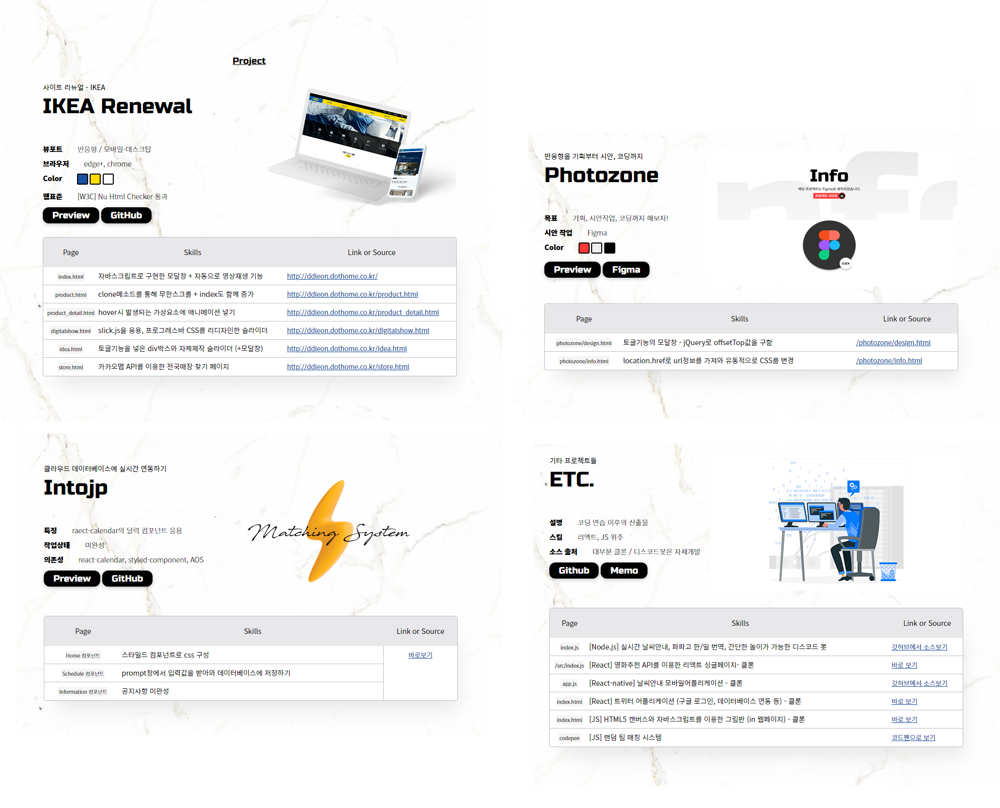

> 개츠비 블로그를 처음으로 만들었다. 첫글은 역시 잡소리가 좋아보인다.

## 2015: 문예창작학과 입학

솔직히 난 어려운 책읽는 것은 고문이라 생각하고,  
예술적인 감성은 없고,  
널리 알리고 싶은 고매한 사상도 없다.  
그냥 살다보니 문창과 전공생이 되었다.

학창시절 교내 독서감상평 대회 같은게 열리면  
네이버에서 검색한 책 줄거리를 짜집기한 다음에,  
적당히 인도주의적인 주장을 덧붙여서 글을 쓰면 상을 받았다.  
남의 생각을 훔쳐다 쓴 벌을 받았다고 생각한다.

순수문학보다는 장르문학이 좋았고,  
장르문학보다는 만화를 더 많이 봤고,  
만화보다는 유튜브가 더 재밌었고,  
유튜브보다는 게임이 더 즐거웠다.

이처럼 순수문학을 하기엔 난 좀... 천박하다.

## 2016: 시각디자인 복수전공

다행히 자아성찰은 잘 되는 편이라  
순수문학 전공과 달리 먹고살 길을 일찍이 찾아보았다.  
평소에 관심이 있던 시각디자인학과 복수전공을 시작했다.

타과생이라고 은근 무시하고 들어오는 `교수`들도,  
그에 반응하는 내 `자격지심`도,  
혼자 수업을 들어야 하는 `외로움`도,  
4kg되는 무거운 `노트북 가방`을 들고 왕복 4시간 학교를 다니는 것도  
뭐 다 참을 수 있었는데

<div class="attach">Professor</div>

```Javascript

switch (과제) {
  case '어떻게든 해간다':
    console.log('창의적인 도형을 만들어야 해. 어디서 본 것 같잖아.');
    break;
  case '특징이 있는 기업을 생각해본다':
    console.log('이런 돈도 안되는 곳 말고, 대기업처럼 만들라고.');
    break;
  case '그라데이션 컬러라도 넣어본다':
    console.log('그라데이션 넣지마.');
    break;
  case '에라 모르겠다':
    console.log('말도 안되는 비율이야.');
    break;
  case '안해간다':
    console.log('다음 주에는 더 해와.');
    break;
  default:
    과제에_엑스표시하기();
    console.log('엑스. 엑스. 엑스.');
}

```

방법론에 대해서는 아무것도 알려주지 않고  
모순적인 평론을 늘어놓는 그 수업을 견디긴 힘들었다.  
그런데 그 사람은 학과장이잖아...?  
결국 시각디자인 복수전공도 그만뒀다.

## 2018: 휴학하고 영상공부하면서 돈벌기

그렇게 남들은 다 쌓는 스펙이나 자격증 하나 없이  
인문학도로서의 4학년이 되었다. 와~

소위 말하는 <strong>스펙쌓기</strong>를 하고자 1년을 휴학했다.  
그 결과 곧바로 남자친구가 생겼는데  
참 재미있는 인간유형이었다.  
일본인이라서 자주 보지도 못하면서도  
한 평생을 함께하고 싶을 정도로 좋아했다.  
이 때 이후로는 무엇을 공부하던지  
오로지 그 사람과 함께하기 위한 도구로서 연마했다.

아무튼 공모전을 하면서 영상편집을 꽤 잘하게 됐는데  
상을 받기도 했고,  
무엇보다 공간에 제약을 받지 않는 편이니  
영상공부를 하면 해외에서도 먹고 살 수 있을 것 같았다.  
영상알바로 투잡을 뛰기도 했다.

- 기획+일러스트+편집+모션그래픽까지 1인으로 뚝딱하던 그시절 산출물


그런데 막상 영상을 진로로 잡고보니
생각보다 안좋은 점들이 많았다.  
단순편집이나 간단한 2D 모션그래픽까지는 쉬웠지만  
그 이상의 프로페셔널한 아트워크를 만들어내기 위해서는  
돈과 시간을 제물로 바쳐야 했지만  
당장 눈 앞의 행복을 좇는 나에겐 불가능한 일이었다.  
영상업계는.. 결국 내 길이 아니었다.

웹디자인 공부나 해볼까? 하다가  
웹디자이너는 코딩도 할 줄 알아야 해 -> 코딩을 공부하는 건가?
-> 프론트엔드 개발자가 되어야지!  
라는 결과가 도출됐다.

## 2020: 졸업하고 국비지원 퍼블리셔 과정 이수

2월에 졸업하면 곧바로 남자친구가 있는 도쿄로 슝~ 날아갈 생각이었다.  
워킹홀리데이 비자를 받고 나면~  
일본에서 아르바이트를 할 수 있을 것이고~  
그러면 연애도 잘 할 수 있을 것이고~  
개발공부도 할 수 있을거다~ 라고 막연하게 생각했다.  
그런데 <strong>코로나</strong>가 터졌다. 와~ 😮 데다네~~  
비행길까지 막혔다.

슬프게도 한국에 남아 개발공부를 시작했다.  
한 번도 프로그래밍 공부를 해본 적 없는  
의지박약 비전공자를 붙잡고 공부시킬 학원이 필요했다.  
그런데 비싼 학원 수업료를 낼 돈은 없었고,  
바로 이수 가능한 국비과정엔 퍼블리셔 과정 뿐이었다.

이미 쓸 줄 아는 포토샵 일러스트레이터를 1개월을 강제로 배워야 했다.  
아무튼 디자인-HTML-CSS-Javascript-jQuery라는 NCS 맞춤형 퍼블리셔 과정을 이수했다.  
나름 반에서 가장 열심히했다고 성적우수상같은걸 받았는데,  
그래도 난 찔밥이었다.

- 그시절 포폴



~~외국인이 4개월 코딩 좀 배웠다고 일본에서 뭘 하겠는가.~~  
코로나 시국은 조금도 나아지지 않았고 일본취업이 더 힘들어졌다.  
결국 내가 할 수 있는 일은  
서울에서 초급 리액트 개발자로 취업을 하는 것 뿐이었다.

## 2021: 그냥 쓰레기처럼 살고 있음

1년이 넘는 시간 사랑하는 사람 한 번 보러가지도 못하고  
23살 이후로의 모든 인생을 갖다 바친  
그 대단해보이던 연애도 끝이났다.

그렇게 난  
문학 0.15스푼, 일본어 0.6스푼, 디자인 1.2스푼, 영상 1.5스푼, 음악 0.5스푼, 개발 2.5스푼을  
섞어 만든 키메라가 되었다.

열정은 많은데 꿈이 없고  
자신을 사랑하지도 못해 다른 사람을 사랑하려 하고  
공부는 하기 싫은데 욕심만 많으면 이렇게 잡스택이 되는 것 같다.

요즘엔 그냥 별 생각없이 하루하루 살고 있다.  
얼굴 붉힐 필요도 없이  
남에게 아쉬운 소리 할 필요 없이  
무던하게 일할 수 있다는 이유만으로 개발업계가 참 마음에 든다.
~~짬차면 다르겠찌?~~

고이는 걸 잘 못해서  
백엔드든 프론트엔드든 일단 여러 갈래로 공부해보려고 한다.  
아직도 나는 방향을 정하지 않았고  
삶의 목적은 또다시 찾아야 할 것 같다.
