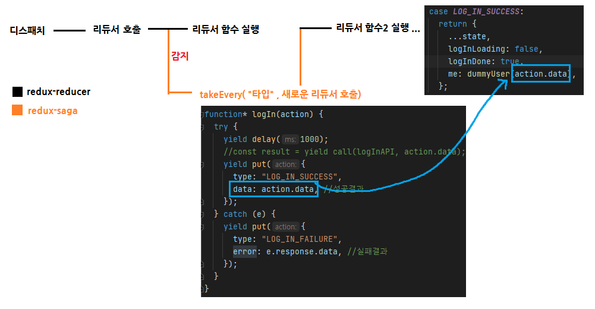

## 대충 saga의 작동방식



## Thunk와 차이: Thunk에선 제공하지 않는 기능도 있음

- setTimeout을 쉽게 구현하는 기능이나,
- 쓰로틀링: 중복요청을 막는 방법. 마지막 요청만 인정해주거나 시간당 횟수 제한 등이 가능
  ⇒ (스크롤이벤트시 요청이 수백개 가는 것을 방지할 때 씀)

## 설치

```bash
npm i redux-saga || npm i next-redux-saga
```

## 제너레이터의 원리로 만들어진다 (생성자 함수)

- Generator : 빠져나갔다가 나중에 다시 돌아와도 사용가능한 함수. 이때 컨텍스트(변수 값)는 출입 과정에서 저장된 상태로 남아 있다.

## 사가 이펙트를 통한 여러 기능들

1.  all : 배열을 받아와 한꺼번에 실행
2.  **fork** : 비동기함수호출(요청 **안기다림**)
3.  **call** : 동기함수호출(요청을 **기다림** - .then()처럼 작동)
4.  take : 액션을 기다림
5.  put : dispatch 와 동일
6.  delay
7.  debounce
8.  throttle
9.  takeLatest: 기존에 진행 중이던 작업이 있다면 취소 처리하고 가장 마지막으로 실행된 작업만 수행한다. (더블클릭 방지 등)
10. takeEvery: take가 비동기로 동작함
11. ....

## 사용방법

```jsx
// 2개가 한 묶음이라고 보면 됨 (api요청함수 따로 / 요청감지함수 따로)

function logInAPI(data) {
  return axios.post('/api/login', data);
}

function* logIn(action) {
  try {
    yield delay(1000);
    //const result = yield call(logInAPI, action.data);
    yield put({
      type: LOG_IN_SUCCESS,
      data: action.data, //성공결과
    });
  } catch (e) {
    yield put({
      type: LOG_IN_FAILURE,
      error: e.response.data, //실패결과
    });
  }
}
```

## saga가 요청을 감지하는 기능: take나 takeLatest나 takeEvery

```jsx
//1 while문 쓰기
function* watchLogin() {
  //이벤트리스너처럼 동작: 비동기액션생성함수가 "특정이벤트" 감지(두번째 매개변수 logIn을 감지한다)
  while (true) {
    yield take('LOG_IN_REQUEST', logIn);
  }
}

//2 takeEvery 쓰기
import { takeEvery } from 'redux-saga/effects';
function* watchLogin() {
  yield takeEvery('LOG_IN_REQUEST', logIn);
}
```

- 단, takeEvery시에는 서버쪽으로 요청은 연속으로 보내진다.
- 응답만 취소할 뿐! 그러니 **서버쪽에서 중복요청을 취소**하도록 하자.
- 일정시간동안 요청 막는 법인 throttle도 있다.

## 세팅 방법

- 컴바인리듀서 처럼 복잡하진 않다
- index.js에 여러 saga들을 묶어주자...

```jsx
// sagas/post.js
export default function* postSaga() {
  yield all([fork(watchAddPost)]);
}

// sagas/index.js
import { all, fork } from 'redux-saga/effects';
import postSaga from './post';
import userSaga from './user';

export default function* rootSaga() {
  yield all([fork(postSaga), fork(userSaga)]);
}
```
